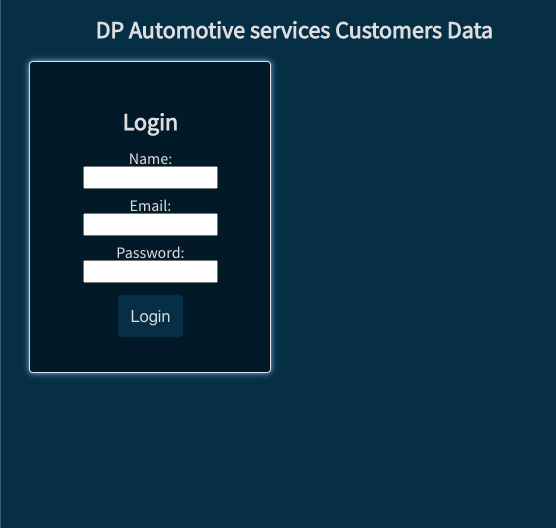
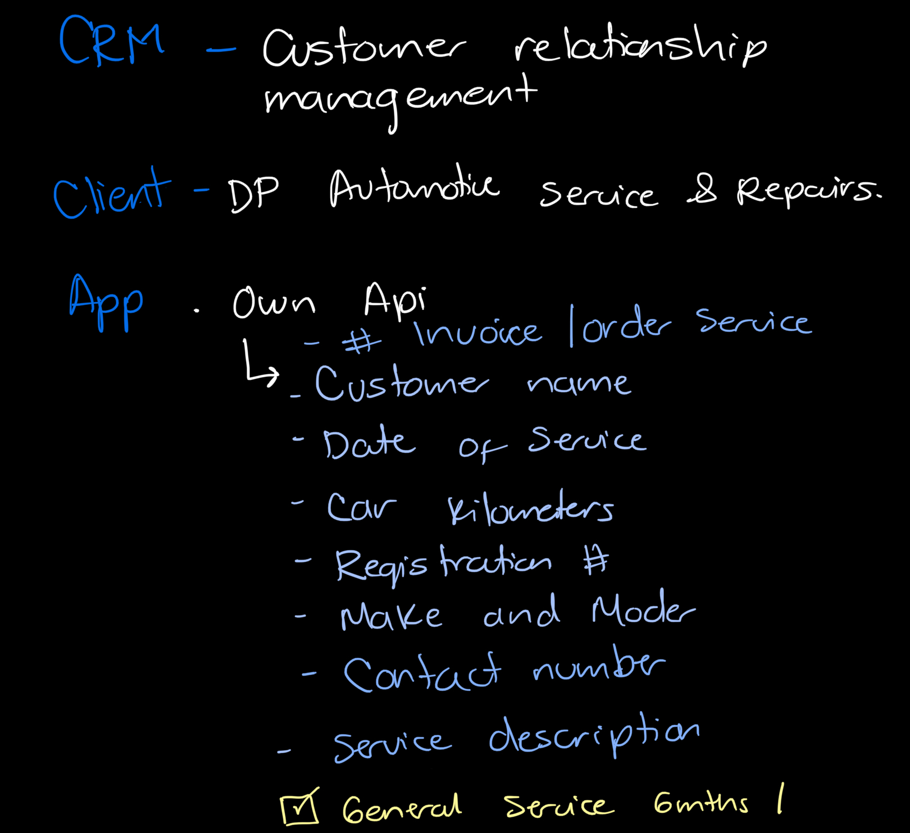
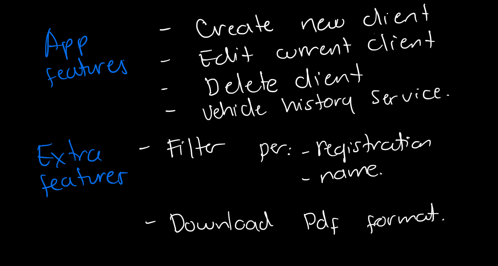

# DP Autoservice Customers Data
DP Autoservices customers Data is is an application for the automotive service company to keep digital records of its customers.

## :computer: [Click here](DPcustomersData.surge.sh) to see my live project!

## :speech_balloon: About
- The first interface shows the Login form where only the administrator has an email account and password previously established, in this way a single account has access to customer data, which allows the confidentiality of the information.

Once inside the application, the user will have the possibility to add clients, edit the information of existing clients, and delete data.

## :memo: Planning:
## Sketchs for the initial idea:
- There are the sketchs used to start the project.

- Working in a team of 3 people, we drew up a plan as follows:
1) Discuss and clarify the idea and goals of the application
2) Map out workflow and divide tasks.
3) We established a time frame od 1 days to obtain the minimum characteristics of the application.
4) After getting the mvp ready, we worked on the design and extra features for the application (minimum length characters for the password, functions to edit, delete, add new profiles).

## :rocket: Cool tech
- Node
- React
- Animations on CSS
- Libraries
- Trello
- package.json
- Hooks in React
- The appearance of the navigation bar is different for the mobile version and for the desktop version.

## :scream: Bugs to fix :poop:
- When you edit it only shows after you refresh.
- Text is overflowing for headline

## :sob: Lessons learnt
- We learned to work in different branches on the terminal.
- To work on Github in collaboration and having the Upstream (The person managing the merging of work on Git.)
- To work on functions to apply based on conditions such as if they are registered what I allow them to do ans see. For example; delete and edit.
- To write functions readable for others so they can continue working on them.
- To manage time as a team.

## :National Park: Future features
- An instant pop message for users when they need help with their account.
- A payment method. 
- Search bar.
- Top skills. 
