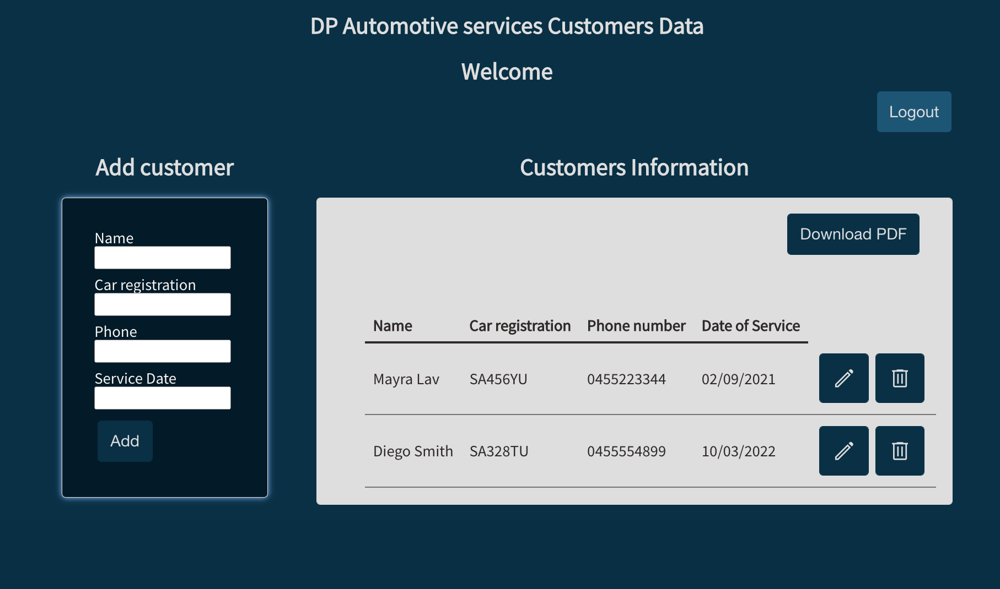

# DP Autoservice Customers Data
DP Autoservices customers Data is is an application for the automotive service company to keep digital records of its customers.

## :computer: [Click here](DPcustomersData.surge.sh) to see my live project!

## :speech_balloon: About
- The first interface shows the Login form where only the administrator has an email account and password previously established, in this way a single account has access to customer data, which allows the confidentiality of the information.

Once inside the application, the user will have the possibility to add clients, edit the information of existing clients, and delete data.

## :memo: Planning:
## Sketchs for the initial idea:
- There are the sketchs used to start the project.

## :rocket: Cool tech
- Node
- React
- Animations on CSS
- Libraries
- Procreate
- package.json
- Hooks in React
- There is a file download button for pdf viewing

## :scream: Bugs to fix :poop:
- When the page is refreshed, the user is automatically logged out.
- When generating the pdf file, you can also see the buttons inside the file.

## :sob: Lessons learnt
- the implementation of the hooks in React and external frameworks such as jspdf.
- To work on functions to apply based on conditions such as if they are registered what I allow them to do ans see. For example; delete and edit.
- To write functions readable for others so they can continue working on them.
- To manage time.

## Future features
- An instant pop message for users when they need help with their account.
- Automatic invoice generator.
- Alerts of the services that are about to be due again according to the date of the previous service

